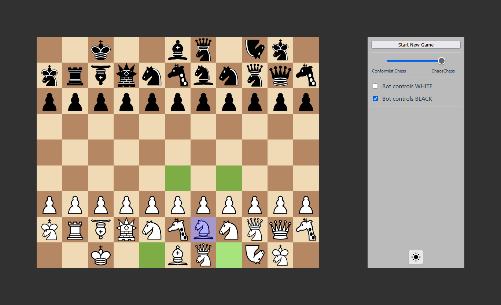

# ChaosChess

## Project Overview

ChaosChess is an implementation of a ”generalized” chess game with custom pieces, variable board sizes, and randomly
generated starting positions. The backend is written in Java, the frontend is built in React.

### Tech Stack

- Backend: Java 21, Spring Boot 3, JUnit 5, Gradle
- Frontend: React 19, Javascript, Vite
- Communication: REST API, WebSocket/STOMP

### Frontend Screenshot



## Features

### Chess Engine

- An extended chess engine that is capable of handling ”fairy chess” pieces with custom movement and capture logic and
  non-standard board sizes
  - Full validation of legal moves, including check, checkmate, and stalemate detection
- All chess piece types are defined in a JSON file ("piece_types.json") that is parsed by the engine on startup
  - 11 fairy chess piece types are currently implemented: Wazir, Ferz, Alfil, Zebra, Giraffe, Mann, Archbishop,
    Chancellor, Amazon, Centaur, Nightrider
  - Movement rules for each chess piece type are codified in a custom string format
  - By modifying the JSON file, piece behaviors can be adjusted or new types added without re-coding the movement logic
- Engine validation via JUnit 5 to ensure the correctness of move generation
  - Performs so-called "perft" (short for "performance test") runs for standard chess, verifying that the number of leaf
    nodes in the tree of possible move sequences matches established reference values at various depths

### Random Board Generator

- Each time a new game is started, a new board with random dimensions and random starting positions is created
  - The smallest possible board is 6x6 squares big; the biggest possible board is 12x12 squares big
  - Rectangular boards with unequal rank and file counts are possible (e.g., 10x8 or 7x11)
  - Black's starting position is always the vertically mirrored version of White's starting position
- The frontend controls feature a slider that controls how random / "chaotic" the created boards are
  - Setting the slider all the way to the left disables the random board generator, this makes it possible to play
    "regular" chess on an 8x8 board with the standard initial position
  - The further the slider is moved to the right, the higher the probability of unconventional board and starting
    positions and the inclusion of fairy chess pieces

### Chess AI

- A relatively simple Chess AI based on the minimax algorithm with alpha-beta pruning
  - The "usual" search depth is currently limited is 3 to 4 ply (half-moves)
  - Additionally, "quiescence search" is implemented: the search for bot moves is extended beyond the above limit
    until no more captures are possible in the next move (in order to avoid "unstable" end nodes in the search tree)
- So-called "piece-square tables" (PSTs) are used to slightly alter the value of a piece depending on how well it is
  positioned
  - For example, a knight that is positioned in the center of the board is rated more highly than a knight on the edge
    of the board
  - The varying board sizes make "hard-coding" the PST values impractical, so a dynamic PST generator was implemented to
    calculate PST values on the fly for any given board dimension
- The frontend features checkboxes to toggle between human and bot control for each side, so human vs human, human vs
  bot and bot vs bot matches are possible

### Frontend

- Move input via mouse (press the left mouse button (LMB) to select a piece, then press LMB again to select the square
  it should move to)
- Possible target squares are highlighted when a piece is hovered or selected (this is helpful for inferring the
  movement rules of the fairy chess pieces)
- A control panel featuring the controls already mentioned in the sections above and a button to toggle between light
  mode and dark mode

### Communication

- Follows a Client-Server architecture currently utilizing a singleton GameManager class (this means that at the moment,
  only one active match at a time is possible)
- The backend is currently configured for local development, including CORS handling to enable seamless communication
  with the frontend
- Executed moves and control panel actions (like starting a new game or toggling bot control) are sent from the frontend
  to Spring Boot @RestController endpoints via REST API
- Real-time game state updates are pushed from the backend to the frontend via WebSocket/STOMP using Spring's
  SimpMessagingTemplate

## Getting Started

### Requirements

- JDK 21+
- Node.js 20+ & npm

### Setup & Run (Linux / macOS)

1. Clone the repository:

```bash
git clone https://github.com/lnickolay/chaoschess.git
```

2. Start the backend (can be done in the same terminal as step 1):

```bash
cd chaoschess/backend
./gradlew bootRun
```

3. Start the frontend (has to be done in a new terminal):

```bash
cd chaoschess/frontend
npm install
npm run dev
```

4. Open the following URL in your browser to access the game (make sure both backend and frontend are running):

`http://localhost:5173`

### Setup & Run (Windows)

Steps 1 and 3 are identical to the ones listed for Linux / macOS above, only step 2 differs slightly:

2. Start the backend (can be done in the same terminal as step 1):

```bash
cd chaoschess/backend
gradlew.bat bootRun
```

## References & Credits

### Assets

SVG Chess Pieces (located in /frontend/public/assets/images/pieces)

- Source: https://commons.wikimedia.org/wiki/Category:SVG_chess_pieces
- Authors: Various
- Licenses: These assets are subject to various licenses as specified by their respective authors on Wikimedia Commons,
  primarily:
  - Creative Commons Attribution-ShareAlike 3.0 (CC BY-SA 3.0)
  - Creative Commons Attribution-ShareAlike 4.0 (CC BY-SA 4.0)
  - Creative Commons Zero (CC0 1.0 / Public Domain)
- Note: For any derivative works or redistributions of these assets, please refer to the specific license of each
  individual file on Wikimedia Commons.

## License

This project is licensed under the MIT License - see the LICENSE.md file for details.

Exceptions: The chess piece images (SVGs) located in /frontend/public/assets/images/pieces are subject to their
respective Creative Commons licenses as detailed in the References & Credits section.
